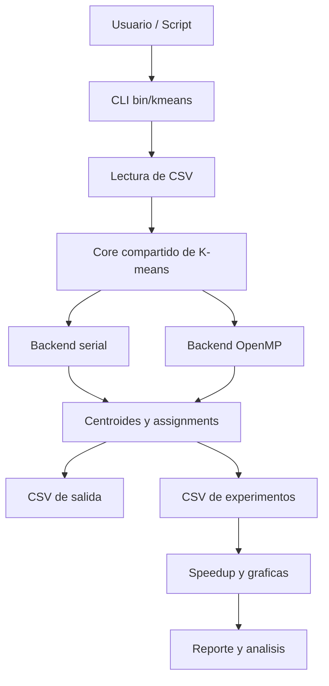
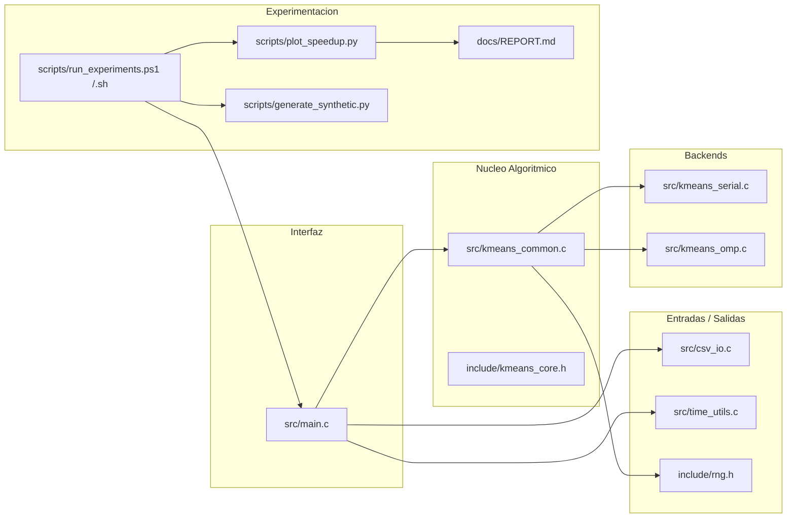

# K-means Paralelo - Índice de Notas

1. [[01_Arquitectura]]
2. [[02_Algoritmo_KMeans]]
3. [[03_Paralelizacion_OpenMP]]
4. [[04_Flujo_y_CLI]]
5. [[05_Datos_CSV_y_Scripts]]
6. [[06_Experimentos_y_Resultados]]
7. [[07_Modulos_y_Codigo]]

## Mapa conceptual general

## Capas del proyecto

