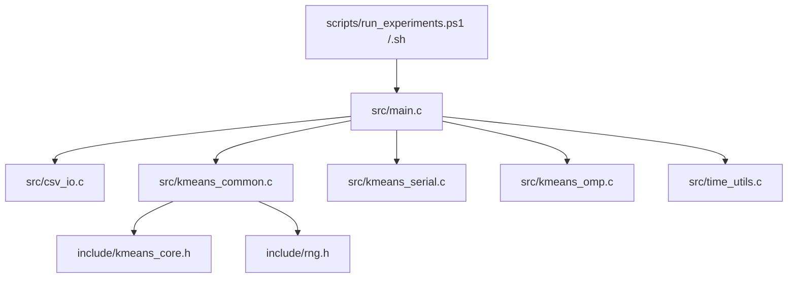
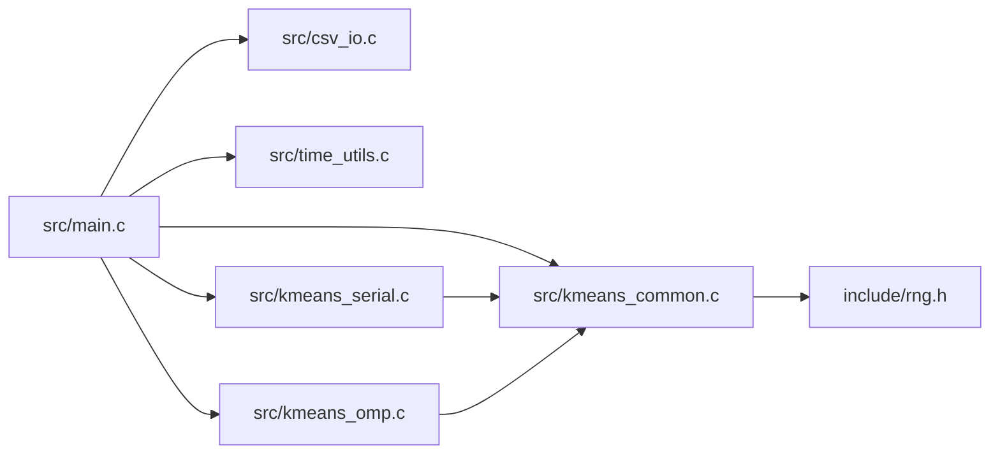
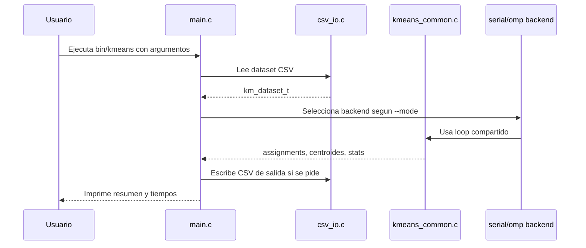

# Arquitectura del Proyecto
## Resumen
El proyecto esta organizado en capas para separar responsabilidades y hacer el codigo mas legible:
- la CLI decide que ejecutar
- `csv_io` convierte archivos en estructuras de datos
- el core compartido implementa la lógica del algoritmo
- los backends serial y OpenMP implementan la fase de asignación/acumulación
- los scripts automatizan experimentos y visualización

## Vista arquitectónica

### 1. Interfaz y orquestación
`src/main.c` no implementa detalles del algoritmo. Su trabajo es:
- parsear argumentos
- cargar el dataset
- elegir el backend
- medir tiempos
- escribir outputs opcionales
- registrar resultados experimentales
### 2. Core del algoritmo
`src/kmeans_common.c` contiene lo que es común a serial y OpenMP:
- validación del problema
- inicialización reproducible de centroides
- actualización de centroides
- loop principal de K-means
- asignación escalar reutilizable
- reserva/liberación de acumuladores
### 3. Backends
Los backends implementan solo la fase que realmente cambia:
- [[07_Modulos_y_Codigo#srckmeans_serialc]]: asignación y acumulación secuencial
- [[07_Modulos_y_Codigo#srckmeans_ompc]]: asignación paralela con acumuladores por hilo
### 4. I/O
`src/csv_io.c` encapsula:
- lectura de CSV con header opcional
- validacion de 2D o 3D
- escritura de assignments
- escritura de centroides
## Diagrama de dependencias

## Flujo de alto nivel

