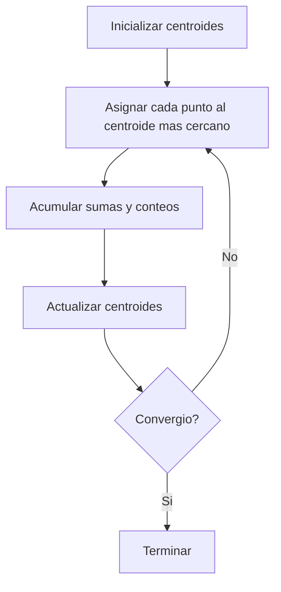

## Problema

K-means agrupa puntos en `k` clusters. Cada cluster se representa con un centroide. El algoritmo
busca una partición donde cada punto quede asignado al centroide mas cercano.
## Flujo iterativo



## Paso 1. Inicializacion de centroides
El proyecto selecciona `k` puntos del dataset como centroides iniciales usando una semilla
reproducible. 

La inicialización usa una variante parcial de Fisher-Yates sobre indices del dataset.
## Paso 2. Asignación
Cada punto se compara con todos los centroides y se escoge el mas cercano.

La distancia usada es la distancia euclidiana al cuadrado:
```text
d^2(p, c) = sum((p_i - c_i)^2)
```
Se usa distancia al cuadrado porque:
- evita calcular raíces en la fase mas costosa
- preserva el orden relativo de cercanía

## Paso 3. Acumulación
Después de decidir el cluster de un punto, el algoritmo actualiza:
- el conteo del cluster
- la suma de coordenadas del cluster
Con esto puede calcular el nuevo centroide al final de la iteración.

## Paso 4. Actualización de centroides
Para cada cluster:
```text
centroide_nuevo = suma_de_puntos / numero_de_puntos
```
Si un cluster queda vacío, se re-inicializa tomando un punto aleatorio del dataset. Esto evita
divisiones entre cero y evita que el algoritmo se estanque con centroides inutiles.
## Criterios de terminación
El algoritmo se detiene si ocurre una de estas condiciones:
- ningún punto cambia de cluster
- el desplazamiento máximo de los centroides es menor que `tol`
- se alcanza `max_iters`

## Complejidad
### Tiempo
Por iteración:
```text
O(N * K * dim)
```
donde:
- `N` = numero de puntos
- `K` = numero de clusters
- `dim` = 2 o 3

### Memoria
La memoria principal del algoritmo es:
- dataset: `O(N * dim)`
- assignments: `O(N)`
- centroides: `O(K * dim)`
- acumuladores: `O(K * dim + K)`

En OpenMP se agregan acumuladores por hilo.
