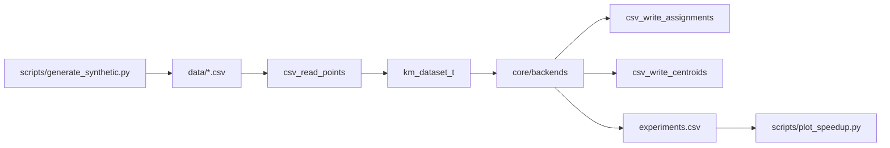
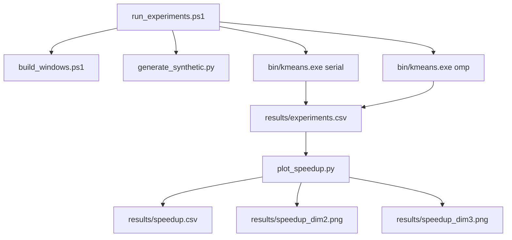

## Papel de esta capa
Esta capa hace que el proyecto sea reproducible. Sin ella habria algoritmo, pero no habria forma
clara de:
- preparar entradas
- correr lotes de pruebas
- guardar resultados
- generar speedups y graficas
## Formato de entrada
El proyecto acepta dos formas de dataset:
- 2D: `x,y`
- 3D: `x,y,z`
Puede existir un header opcional.
## Formato de salida
### Points -> cluster
```text
x,y,cluster
x,y,z,cluster
```
### Centroides
```text
cluster,cx,cy
cluster,cx,cy,cz
```
### Experimentos
```text
dim,N,k,mode,threads,run_idx,iters,kernel_ms,total_ms
```
## `src/csv_io.c`
Sus responsabilidades son:
- leer CSV con líneas numéricas
- tolerar un header textual al inicio
- validar consistencia de columnas
- compactar los puntos a dimension real
- escribir outputs de puntos y centroides
## Pipeline de datos

## `scripts/generate_synthetic.py`
Genera datos sinteticos agrupados. Parametros importantes:
- `--dim`
- `--n`
- `--k`
- `--seed`
- `--std`
- `--spread`

## `scripts/run_experiments.ps1`
Es el flujo oficial para Windows nativo.
### Que hace
1. compila con `scripts/build_windows.ps1`
2. captura info de hardware/software con PowerShell y CIM
3. genera datasets si faltan
4. ejecuta serial y OpenMP para cada configuracion
5. valida el CSV final
6. genera archivos representativos de clusters y centroides
7. llama a `plot_speedup.py`

## `scripts/run_experiments.sh`
Este script sigue disponible como alternativa para Linux/WSL.
### Que hace
1. compila el proyecto
2. captura info de hardware/software
3. genera datasets si faltan
4. ejecuta serial y OpenMP para cada configuración
5. valida el CSV final
## `scripts/plot_speedup.py`
Este script toma `experiments.csv` y:
- agrupa por configuración
- promedia la métrica elegida
- calcula speedup contra la baseline serial
- exporta `speedup.csv`
- crea graficas PNG
## Diagrama de automatizacion


