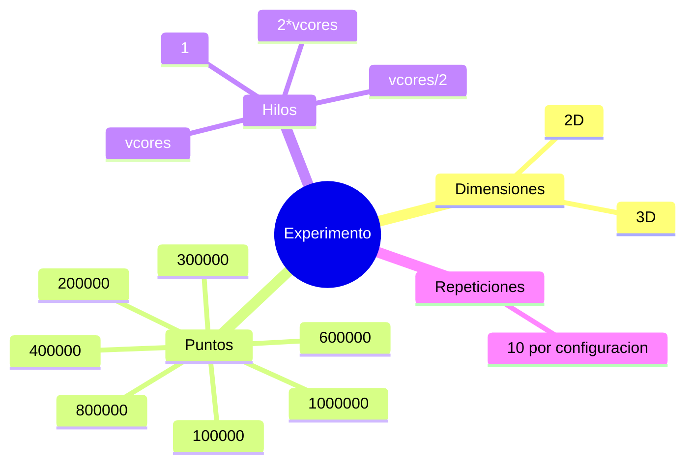

## Objetivo experimental
Comparar la version paralela contra la version serial en una malla de configuraciones que permita
observar como cambia el rendimiento según:
- dimension
- numero de puntos
- numero de hilos
## Malla experimental


## Metricas
### `kernel_ms`
Tiempo del algoritmo sin I/O. Es la metrica principal para speedup.
### `total_ms`
Tiempo total observable.
## Formula de speedup
```text
speedup = promedio(kernel_ms_serial) / promedio(kernel_ms_omp)
```
Si el speedup es:
- `1`: no hubo ganancia
- `>1`: la version paralela fue mejor
- `<1`: la version paralela fue peor en esa configuración
## Equipo de pruebas
Segun `results/system_info.txt`:
- CPU: 11th Gen Intel Core i7-1195G7 @ 2.90GHz
- cores fisicos: `4`
- vcores: `8`
- compilador: GCC 15.2.0 (MSYS2 UCRT64)
- Windows 11 Home, build `26200`
## Interpretación

### 1 hilo
OpenMP con `1` hilo suele quedar cerca de la version serial o incluso un poco por debajo. Esto es
normal porque existe overhead del runtime y de la infraestructura adicional.
### 4 y 8 hilos
Aquí ya se observa una mejora fuerte porque el trabajo por punto alcanza para amortizar el overhead.
### 16 hilos
En este equipo, la configuración con `16` hilos resulto la mejor en la mayoría de los casos y
produjo el mejor speedup global del experimento.
### Entradas grandes
A mayor `N`, el speedup mejora porque el costo fijo de paralelizar pesa menos.

No se debe esperar speedup lineal perfecto. Las causas principales son:
- ancho de banda de memoria
- sincronizacion residual
- reduccion de acumuladores
- comportamiento de caches
- overhead de crear y coordinar hilos


