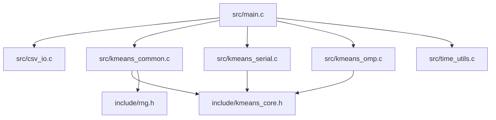

## Mapa de archivos

## `src/main.c`
Responsable de la orquestación.
### Bloques principales
- configuracion (`app_config_t`)
- parsing y validación de argumentos
- lectura del dataset
- selección del backend
- medición de tiempos
- escritura de outputs
- logging experimental
## `src/kmeans_common.c`
Este archivo contiene el core compartido.
### Funciones conceptuales
- validación del problema
- reserva/liberación de acumuladores
- inicialización reproducible de centroides
- actualización de centroides
- loop principal de K-means
- asignación escalar compartida
## `src/kmeans_serial.c`
Es un backend pequeño que solo delega al runner compartido usando la asignación escalar.
## `src/kmeans_omp.c`
Implementa el backend paralelo.
### Elementos clave
- contexto `km_omp_ctx_t`
- buffers por hilo
- alineacion y padding
- region `#pragma omp parallel`
- reduccion manual
## `src/csv_io.c`
Encapsula el parsing y la escritura de archivos.
### Responsabilidades
- parsear lineas numericas
- detectar headers opcionales
- compactar 2D/3D
- escribir CSVs consistentes
## `include/kmeans_core.h`
Define la interfaz interna del core:
- estructura `km_accum_t`
- callback de backend `km_assign_fn`
- helper de distancia
- helper de centroide mas cercano
- primitivas del core compartido
## `include/rng.h`
RNG header-only reproducible. Su uso principal es:
- inicialización reproducible de centroides
- re-inicialización de clusters vacíos
## `src/time_utils.c`
Envuelve el reloj monótono usado para mediciones.
## `scripts/*.py` y `scripts/*.sh`
No forman parte del algoritmo, pero si del sistema completo de evaluación:
- preparan datos
- ejecutan lotes
- resumen resultados
