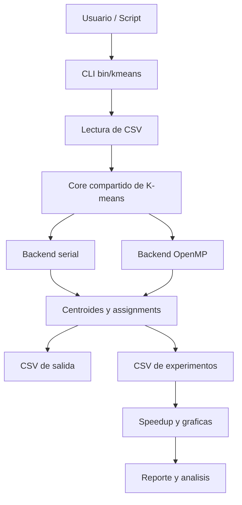
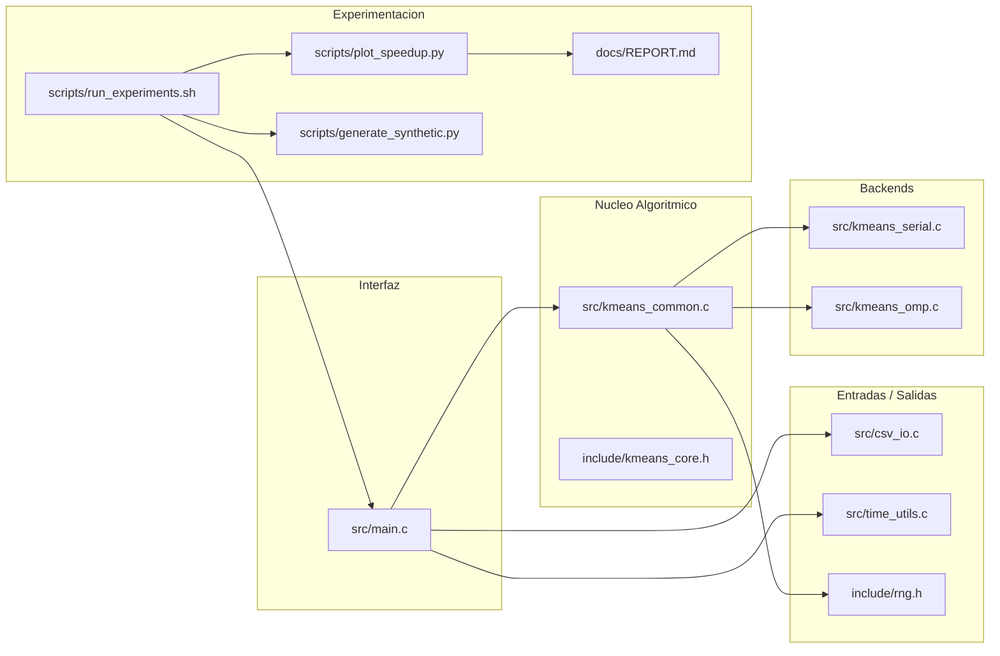

# K-means Paralelo - Indice de Notas

Esta carpeta convierte el proyecto en una base de conocimiento de Obsidian. La idea es poder
entender el sistema desde varios niveles:

- vista general del proyecto
- arquitectura del codigo
- algoritmo y flujo de ejecucion
- estrategia de paralelizacion
- experimentos, resultados y speedup
- decisiones de ingenieria y justificaciones

## Como navegar

- Punto de entrada recomendado: [[01_Arquitectura]]
- Para entender el algoritmo: [[02_Algoritmo_KMeans]]
- Para entender OpenMP: [[03_Paralelizacion_OpenMP]]
- Para seguir el flujo CLI -> CSV -> K-means -> resultados: [[04_Flujo_y_CLI]]
- Para revisar datos y scripts: [[05_Datos_CSV_y_Scripts]]
- Para estudiar la evaluacion experimental: [[06_Experimentos_y_Resultados]]
- Para una lectura modulo por modulo: [[07_Modulos_y_Codigo]]
- Para ver decisiones, trade-offs y riesgos: [[08_Decisiones_y_Riesgos]]
- Para vista visual del proyecto: [[KMeans_Proyecto.canvas]]

## Mapa conceptual general

## Capas del proyecto

## Preguntas que estas notas responden

- Que hace exactamente el algoritmo en cada iteracion
- Que parte se paraleliza y por que
- Donde estaban los riesgos de carrera y como se evitaron
- Como fluye la informacion desde un CSV de entrada hasta las graficas
- Como se calcula el speedup y por que se usa `kernel_ms`
- Que rol cumple cada archivo del proyecto
- Que decisiones de diseno se tomaron y cuales fueron sus trade-offs

## Recomendacion de lectura

1. [[01_Arquitectura]]
2. [[02_Algoritmo_KMeans]]
3. [[03_Paralelizacion_OpenMP]]
4. [[04_Flujo_y_CLI]]
5. [[05_Datos_CSV_y_Scripts]]
6. [[06_Experimentos_y_Resultados]]
7. [[08_Decisiones_y_Riesgos]]
