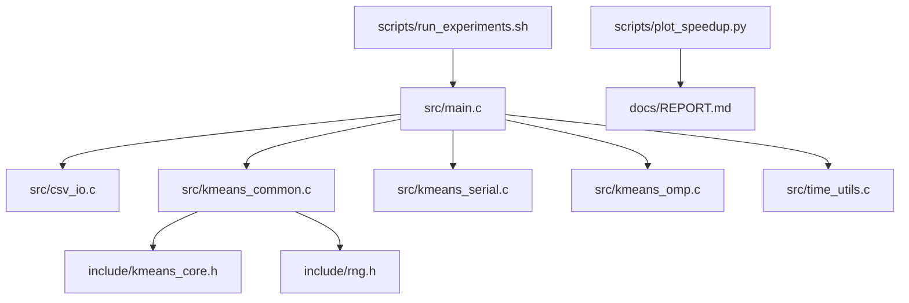
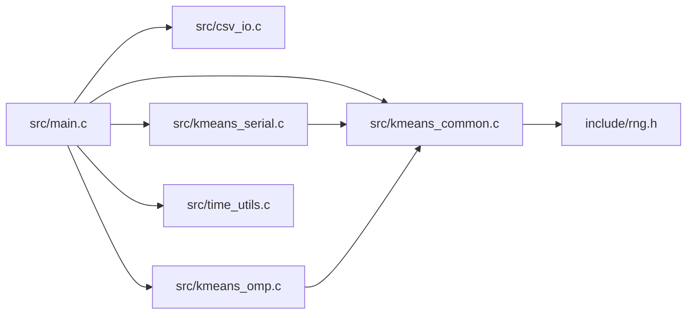
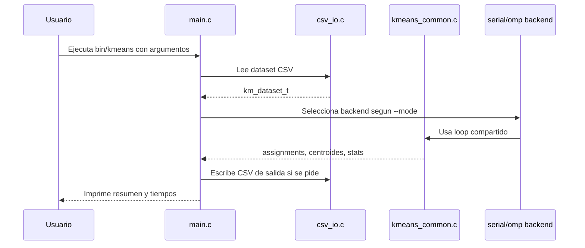

# Arquitectura del Proyecto

## Resumen

El proyecto esta organizado en capas para separar responsabilidades y hacer el codigo mas legible:

- la CLI decide que ejecutar
- `csv_io` convierte archivos en estructuras de datos
- el core compartido implementa la logica del algoritmo
- los backends serial y OpenMP implementan la fase de asignacion/acumulacion
- los scripts automatizan experimentos y visualizacion

## Vista arquitectonica

## Principio de separacion de responsabilidades

### 1. Interfaz y orquestacion

`src/main.c` no implementa detalles del algoritmo. Su trabajo es:

- parsear argumentos
- cargar el dataset
- elegir el backend
- medir tiempos
- escribir outputs opcionales
- registrar resultados experimentales

Esto evita que la logica del algoritmo quede mezclada con detalles de linea de comandos o manejo de
archivos.

### 2. Core del algoritmo

`src/kmeans_common.c` contiene lo que es comun a serial y OpenMP:

- validacion del problema
- inicializacion reproducible de centroides
- actualizacion de centroides
- loop principal de K-means
- asignacion escalar reutilizable
- reserva/liberacion de acumuladores

### 3. Backends

Los backends implementan solo la fase que realmente cambia:

- [[07_Modulos_y_Codigo#srckmeans_serialc]]: asignacion y acumulacion secuencial
- [[07_Modulos_y_Codigo#srckmeans_ompc]]: asignacion paralela con acumuladores por hilo

### 4. I/O

`src/csv_io.c` encapsula:

- lectura de CSV con header opcional
- validacion de 2D o 3D
- escritura de assignments
- escritura de centroides

## Diagrama de dependencias

## Justificacion de esta arquitectura

### Claridad

Cada archivo responde una pregunta concreta:

- como entra y sale la informacion
- como se ejecuta K-means
- como se hace la parte serial
- como se hace la parte paralela

### Reutilizacion

La logica de convergencia, centroides y validacion vive una sola vez. Eso reduce errores y asegura
que serial y paralelo sean comparables.

### Mantenibilidad

Si en el futuro se quisiera agregar otro backend, por ejemplo `pthread`, bastaria con implementar un
nuevo backend para la fase de asignacion sin reescribir el loop principal del algoritmo.

## Flujo de alto nivel

## Puntos de lectura relacionados

- [[02_Algoritmo_KMeans]]
- [[03_Paralelizacion_OpenMP]]
- [[07_Modulos_y_Codigo]]
