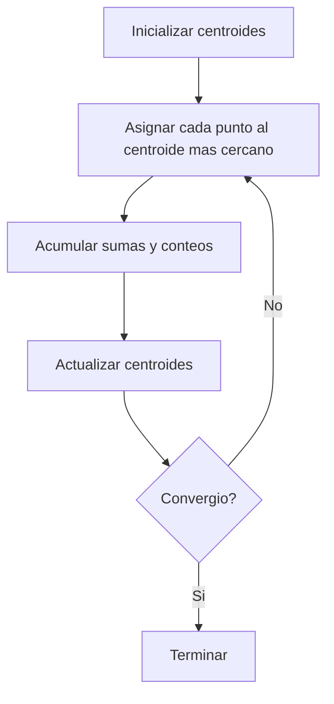
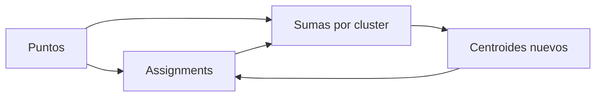

# Algoritmo K-means

## Que problema resuelve

K-means agrupa puntos en `k` clusters. Cada cluster se representa con un centroide. El algoritmo
busca una particion donde cada punto quede asignado al centroide mas cercano.

## Estado que maneja el algoritmo

- dataset `points`
- numero de clusters `k`
- arreglo `assignments`
- arreglo `centroids`
- acumuladores de sumas por cluster
- acumuladores de conteos por cluster

## Flujo iterativo



## Paso 1. Inicializacion de centroides

El proyecto selecciona `k` puntos del dataset como centroides iniciales usando una semilla
reproducible. La reproducibilidad es importante por dos razones:

- permite comparar serial y paralelo en condiciones equivalentes
- vuelve repetibles los experimentos

La inicializacion usa una variante parcial de Fisher-Yates sobre indices del dataset.

## Paso 2. Asignacion

Cada punto se compara con todos los centroides y se escoge el mas cercano.

La distancia usada es la distancia euclidiana al cuadrado:

```text
d^2(p, c) = sum((p_i - c_i)^2)
```

Se usa distancia al cuadrado porque:

- evita calcular raices en la fase mas costosa
- preserva el orden relativo de cercania

## Paso 3. Acumulacion

Despues de decidir el cluster de un punto, el algoritmo actualiza:

- el conteo del cluster
- la suma de coordenadas del cluster

Con esto puede calcular el nuevo centroide al final de la iteracion.

## Paso 4. Actualizacion de centroides

Para cada cluster:

```text
centroide_nuevo = suma_de_puntos / numero_de_puntos
```

Si un cluster queda vacio, se re-inicializa tomando un punto aleatorio del dataset. Esto evita
divisiones entre cero y evita que el algoritmo se estanque con centroides inutiles.

## Criterios de terminacion

El algoritmo se detiene si ocurre una de estas condiciones:

- ningun punto cambia de cluster
- el desplazamiento maximo de los centroides es menor que `tol`
- se alcanza `max_iters`

## Complejidad

### Tiempo

Por iteracion:

```text
O(N * K * dim)
```

donde:

- `N` = numero de puntos
- `K` = numero de clusters
- `dim` = 2 o 3

### Memoria

La memoria principal del algoritmo es:

- dataset: `O(N * dim)`
- assignments: `O(N)`
- centroides: `O(K * dim)`
- acumuladores: `O(K * dim + K)`

En OpenMP se agregan acumuladores por hilo.

## Diagrama de datos



## Invariantes importantes

- cada punto pertenece a exactamente un cluster
- cada centroide tiene `dim` coordenadas
- `assignments[i]` siempre esta en `[0, k-1]` despues de la primera iteracion
- serial y paralelo deben producir la misma semantica general aunque el orden de acumulacion pueda
  variar ligeramente por flotantes

## Por que este algoritmo se presta a paralelizacion

La fase de asignacion procesa muchos puntos independientes. Cada punto:

- lee centroides
- decide un cluster
- contribuye a acumuladores

La independencia natural por punto es lo que hace posible repartir el trabajo entre hilos.

## Lecturas relacionadas

- [[03_Paralelizacion_OpenMP]]
- [[06_Experimentos_y_Resultados]]
- [[08_Decisiones_y_Riesgos]]
