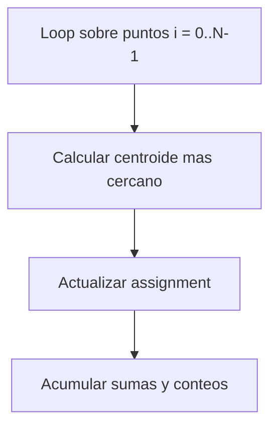
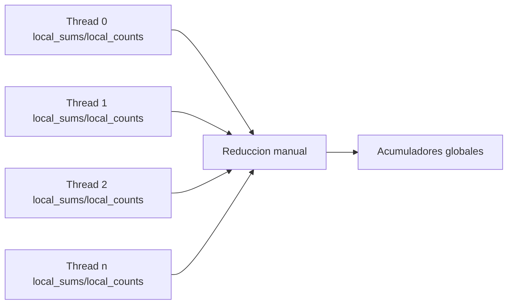
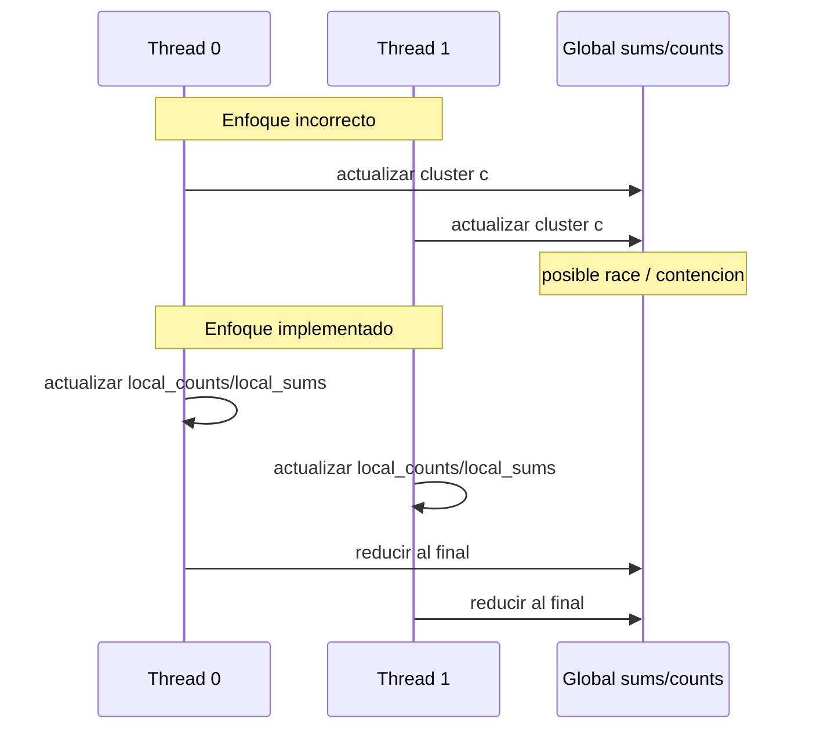

# Paralelizacion con OpenMP

## Idea central

La parte dominante de K-means es la asignacion de puntos a clusters. La paralelizacion consiste en
distribuir ese recorrido entre varios hilos.

## Donde se paraleliza



El loop sobre puntos es el objetivo natural de OpenMP.

## Problema de concurrencia

Si varios hilos actualizaran directamente:

- `global_counts[c]`
- `global_sums[c][d]`

se producirian condiciones de carrera.

## Solucion: acumuladores privados por hilo

Cada hilo posee:

- `local_counts[cluster]`
- `local_sums[cluster][dim]`

y solo al final se hace una reduccion manual.



## Justificacion de esta estrategia

### Por que no `critical`

Un `critical` por punto haria que los hilos pelearan constantemente por una misma seccion critica.
Eso destruiria gran parte del beneficio paralelo.

### Por que no `atomic`

Aunque `atomic` es mas fino que `critical`, seguiria habiendo demasiadas operaciones sincronizadas:

- una por conteo
- varias por cada suma de coordenada

El costo seria demasiado alto en comparacion con la cantidad de trabajo util.

### Por que buffers por hilo

Los buffers por hilo permiten:

- trabajo local sin contencion
- acceso mas predecible a memoria
- reduccion final controlada y facil de razonar

## Estructura del backend OpenMP

```mermaid
flowchart TD
    A[Reservar buffers por hilo] --> B[Entrar a region paralela]
    B --> C[omp for schedule(static)]
    C --> D[Cada hilo asigna puntos y acumula localmente]
    D --> E[Salir de la region paralela]
    E --> F[Reducir thread_sums y thread_counts]
    F --> G[Actualizar centroides con acumuladores globales]
```

## Sobre `schedule(static)`

Se elige `schedule(static)` porque:

- el trabajo por punto es relativamente uniforme
- tiene poco overhead
- es facil de razonar
- suele dar buena localidad

## Padding y alineacion

En el backend OpenMP se usan strides redondeados y memoria alineada para reducir el riesgo de false
sharing. La idea es separar suficientemente los bloques por hilo para que no compitan tanto por las
mismas lineas de cache.

## Reduccion manual

La reduccion manual significa que el proyecto no depende de una construccion de OpenMP para arreglos
multidimensionales con suma personalizada. En vez de eso:

1. cada hilo llena sus acumuladores
2. el programa suma esos acumuladores a un arreglo global

Esto es mas verboso, pero muy claro y controlable.

## Semantica compartida con serial

Una decision clave del refactor fue que serial y paralelo comparten:

- inicializacion
- criterio de convergencia
- actualizacion de centroides
- manejo de clusters vacios

Con esto se asegura que la comparacion de rendimiento sea justa: cambia la estrategia de asignacion,
no la definicion del algoritmo.

## Riesgos principales y como se mitigaron

| Riesgo | Mitigacion |
| --- | --- |
| data races | acumuladores privados por hilo |
| overhead excesivo | `schedule(static)` y buffers reutilizados |
| false sharing | padding y alineacion |
| comparacion injusta con serial | core compartido |
| sobre-suscripcion no medible | `--threads` respeta el valor solicitado |

## Diagrama de carrera evitada



## Lecturas relacionadas

- [[02_Algoritmo_KMeans]]
- [[07_Modulos_y_Codigo]]
- [[08_Decisiones_y_Riesgos]]
