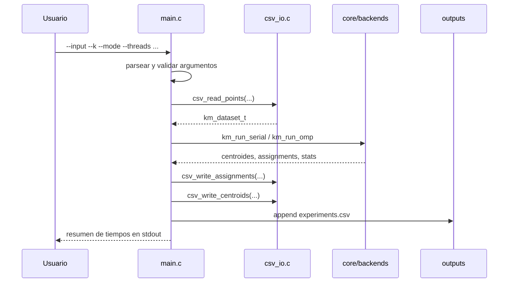
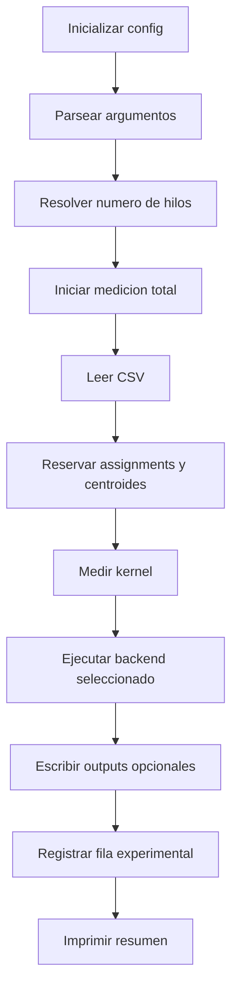

# Flujo de Ejecucion y CLI

## Objetivo de esta nota

Explicar como viaja la informacion desde la linea de comandos hasta los artefactos de salida.

## Flujo general



## Parametros principales

### `--input`

Ruta del CSV de entrada. Debe contener 2 o 3 columnas numericas, con header opcional.

### `--k`

Numero de clusters.

### `--mode`

- `serial`
- `omp`

### `--threads`

Solo aplica a `omp`. Despues de la limpieza del proyecto, el backend respeta el numero exacto de
hilos solicitado.

### `--dim`

Permite forzar `2` o `3`. Si se omite, se infiere del CSV.

### `--out`

Escribe el CSV con puntos etiquetados.

### `--centroids`

Escribe el CSV con centroides.

### `--log-csv`

Agrega una fila al archivo de experimentos.

## Flujo interno de `main.c`



## Por que separar `kernel_ms` y `total_ms`

### `kernel_ms`

Sirve para evaluar el algoritmo puro y medir speedup de computo.

### `total_ms`

Sirve para entender el costo total observable por usuario, incluyendo:

- lectura del CSV
- ejecucion del algoritmo
- escritura de salidas

Esto da dos perspectivas utiles:

- rendimiento del algoritmo
- costo de uso end-to-end

## Salidas

### 1. Salida estandar

Imprime una linea con:

- modo
- hilos
- `N`
- `dim`
- `k`
- iteraciones
- `kernel_ms`
- `total_ms`

### 2. CSV de assignments

```text
x,y,cluster
x,y,z,cluster
```

### 3. CSV de centroides

```text
cluster,cx,cy
cluster,cx,cy,cz
```

### 4. Log experimental

```text
dim,N,k,mode,threads,run_idx,iters,kernel_ms,total_ms
```

## Relacion con los scripts

- `run_experiments.sh` llama repetidamente al binario
- `plot_speedup.py` consume el CSV experimental generado por `main.c`

## Lecturas relacionadas

- [[05_Datos_CSV_y_Scripts]]
- [[06_Experimentos_y_Resultados]]
