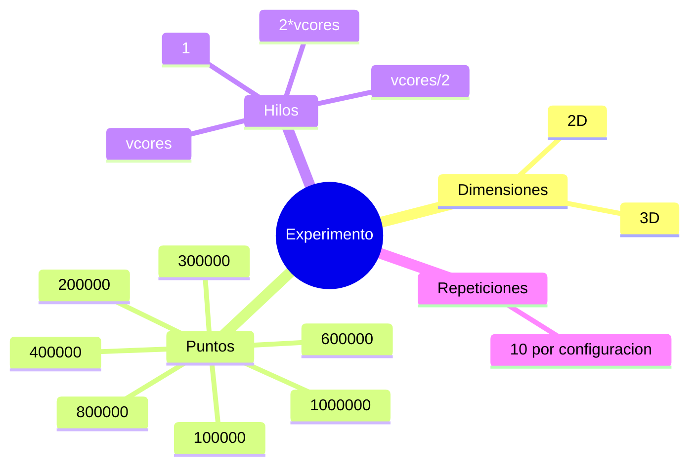

# Experimentos, Speedup y Resultados

## Objetivo experimental

Comparar la version paralela contra la version serial en una malla de configuraciones que permita
observar como cambia el rendimiento segun:

- dimension
- numero de puntos
- numero de hilos

## Malla experimental



## Metricas

### `kernel_ms`

Tiempo del algoritmo sin I/O. Es la metrica principal para speedup.

### `total_ms`

Tiempo total observable.

## Formula de speedup

```text
speedup = promedio(kernel_ms_serial) / promedio(kernel_ms_omp)
```

Si el speedup es:

- `1`: no hubo ganancia
- `>1`: la version paralela fue mejor
- `<1`: la version paralela fue peor en esa configuracion

## Por que promediar 10 corridas

Promediar reduce ruido producido por:

- planificacion del sistema operativo
- fluctuacion de frecuencia
- caches y calentamiento
- interferencia del entorno

## Equipo de pruebas

Segun `results/system_info.txt`:

- CPU: Intel i5-13420H
- vcores: `12`
- compilador: GCC 13.3.0
- Linux/Ubuntu 24.04

## Resultados destacados

Segun `results/speedup.csv`:

- mejor speedup global: `3.409606`
- mejor configuracion global: `2D`, `N=1000000`, `threads=12`
- mejor speedup en 3D: `3.155003`
- mejor configuracion en 3D: `N=800000`, `threads=12`

## Interpretacion

### 1 hilo

OpenMP con `1` hilo suele quedar cerca de la version serial o incluso un poco por debajo. Esto es
normal porque existe overhead del runtime y de la infraestructura adicional.

### 6 y 12 hilos

Aqui ya se observa una mejora fuerte porque el trabajo por punto alcanza para amortizar el overhead.

### Entradas grandes

A mayor `N`, el speedup mejora porque el costo fijo de paralelizar pesa menos.

## Diagrama de lectura de resultados


## Lectura critica del resultado

No se debe esperar speedup lineal perfecto. Las causas principales son:

- ancho de banda de memoria
- sincronizacion residual
- reduccion de acumuladores
- comportamiento de caches
- overhead de crear y coordinar hilos

## Que significa cumplir el proyecto

La nota exigia al menos un speedup de `1.5`. El resultado observado supera ampliamente esa meta.

## Preguntas para analizar cuando se regeneren resultados

- El caso de `24` hilos mejora o empeora respecto a `12`?
- El comportamiento en `3D` es mas favorable que en `2D`?
- Hay un punto donde aumentar hilos deja de ayudar?
- `total_ms` cuenta la misma historia que `kernel_ms`?

## Lecturas relacionadas

- [[03_Paralelizacion_OpenMP]]
- [[05_Datos_CSV_y_Scripts]]
- [[08_Decisiones_y_Riesgos]]
