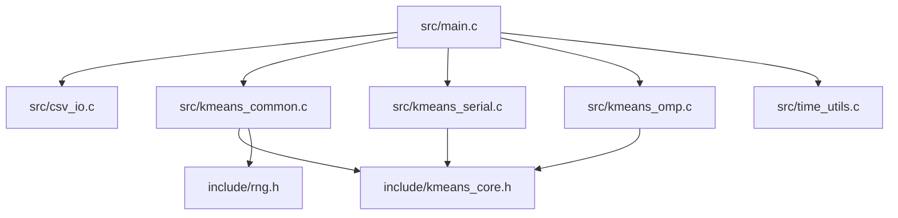

# Modulos y Codigo Fuente

## Mapa de archivos

## `src/main.c`

Responsable de la orquestacion.

### Bloques principales

- configuracion (`app_config_t`)
- parsing y validacion de argumentos
- lectura del dataset
- seleccion del backend
- medicion de tiempos
- escritura de outputs
- logging experimental

### Justificacion

Mantener `main.c` como orquestador hace que sea facil seguir el flujo sin perderse en detalles del
algoritmo.

## `src/kmeans_common.c`

Este archivo contiene el core compartido.

### Funciones conceptuales

- validacion del problema
- reserva/liberacion de acumuladores
- inicializacion reproducible de centroides
- actualizacion de centroides
- loop principal de K-means
- asignacion escalar compartida

### Por que importa

Es la pieza que evita divergencia semantica entre serial y paralelo.

## `src/kmeans_serial.c`

Es un backend pequeno que solo delega al runner compartido usando la asignacion escalar.

### Beneficio

El backend serial queda trivial de entender y de comparar contra el paralelo.

## `src/kmeans_omp.c`

Implementa el backend paralelo.

### Elementos clave

- contexto `km_omp_ctx_t`
- buffers por hilo
- alineacion y padding
- region `#pragma omp parallel`
- reduccion manual

### Que cambia respecto a serial

Solo cambia la forma de hacer la fase de asignacion/acumulacion.

## `src/csv_io.c`

Encapsula el parsing y la escritura de archivos.

### Responsabilidades

- parsear lineas numericas
- detectar headers opcionales
- compactar 2D/3D
- escribir CSVs consistentes

## `include/kmeans_core.h`

Define la interfaz interna del core:

- estructura `km_accum_t`
- callback de backend `km_assign_fn`
- helper de distancia
- helper de centroide mas cercano
- primitivas del core compartido

## `include/rng.h`

RNG header-only reproducible. Su uso principal es:

- inicializacion reproducible de centroides
- re-inicializacion de clusters vacios

## `src/time_utils.c`

Envuelve el reloj monotono usado para mediciones.

## `scripts/*.py` y `scripts/*.sh`

No forman parte del algoritmo, pero si del sistema completo de evaluacion:

- preparan datos
- ejecutan lotes
- resumen resultados

## Lecturas relacionadas

- [[01_Arquitectura]]
- [[04_Flujo_y_CLI]]
