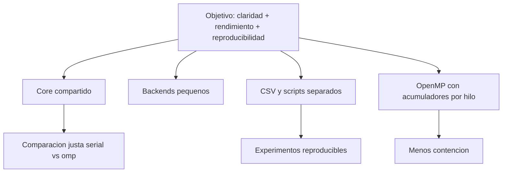

# Decisiones de Ingenieria, Trade-offs y Riesgos

## Objetivo de esta nota

Explicar no solo que hace el proyecto, sino por que esta hecho asi y no de otra manera.

## Decision 1. Core compartido para serial y OpenMP

### Justificacion

Si serial y paralelo implementaran loops completos separados, seria facil introducir diferencias
involuntarias en:

- convergencia
- manejo de clusters vacios
- inicializacion
- estadisticas

### Trade-off

- Pro: coherencia semantica
- Pro: menos duplicacion
- Contra: requiere una API interna un poco mas abstracta

## Decision 2. Aislacion de `main.c`

### Justificacion

Se busco que el programa pudiera leerse como una tuberia:

```text
parsear -> leer -> correr -> escribir -> loggear
```

### Beneficio

Mejora onboarding y depuracion.

## Decision 3. RNG header-only

### Justificacion

El RNG es pequeno y auto-contenido. Mantenerlo header-only:

- evita un modulo `.c` innecesario
- reduce ruido estructural
- deja claro que es una utilidad pequena

### Buena practica aplicada

Se elimino el archivo fuente vacio que solo confundia.

## Decision 4. Acumuladores privados por hilo

### Alternativas descartadas

- `critical`
- `atomic`
- actualizacion global directa

### Justificacion

Los acumuladores privados por hilo reducen contencion y son una estrategia clasica para este patron.

## Decision 5. `kernel_ms` como metrica principal

### Justificacion

La comparacion de speedup debe medir el algoritmo, no el costo variable de I/O.

### Complemento

Tambien se registra `total_ms` para tener una perspectiva end-to-end.

## Riesgos tecnicos

### 1. Duplicacion residual

Riesgo: que serial y OpenMP vuelvan a divergir.  
Mitigacion: mantener el runner comun y el helper escalar compartido.

### 2. Float no bit-a-bit igual

Riesgo: el orden de reduccion paralelo puede producir ligeras diferencias numericas.  
Mitigacion: aceptar equivalencia semantica, no identidad binaria exacta.

### 3. Sobre-suscripcion

Riesgo: pedir mas hilos que vcores puede empeorar rendimiento.  
Mitigacion: se permite medirlo, no se asume que siempre ayuda.

### 4. Overhead de OpenMP en entradas pequenas

Riesgo: speedup pobre o negativo cuando `N` es pequeno.  
Mitigacion: analizar resultados por tamano de entrada y no solo por un caso.

## Riesgos de documentacion

- confundir `kernel_ms` con `total_ms`
- interpretar speedup de `1` hilo como obligatoriamente mejor que serial
- asumir escalamiento lineal

## Recomendaciones futuras

- agregar pruebas automatizadas de correctitud entre serial y paralelo
- guardar snapshots de resultados experimentales completos regenerados
- agregar una comparacion de `12` vs `24` hilos cuando se corra la malla final actualizada

## Diagrama de decisiones



## Cierre

El proyecto no solo busca ser rapido. Tambien busca ser:

- explicable
- mantenible
- reproducible
- defendible academicamente

## Lecturas relacionadas

- [[01_Arquitectura]]
- [[03_Paralelizacion_OpenMP]]
- [[06_Experimentos_y_Resultados]]
